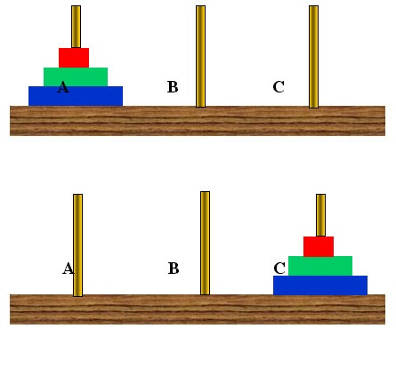

<h1 align="center">Estrutura de Dados em C</h1>

<p align="center">Aplicações em C para fins didáticos em Estrutura de Dados com lógica de programação, manipulação de strings, ponteiros, alocação dinâmica, declaração de novos tipos, diretivas de compilação, recursividade e listas lineares</p>

## :clipboard: Tópicos

* [sequencias-matematica](https://github.com/YuriSiman/data-structures-exercises-c#sequencias-matematica)  
* [manipulacao-de-string](https://github.com/YuriSiman/data-structures-exercises-c#manipulacao-de-string)  
* [alocacao-dinamica](https://github.com/YuriSiman/data-structures-exercises-c#alocacao-dinamica)  
* [passagem-de-parametro-por-referencia](https://github.com/YuriSiman/data-structures-exercises-c#passagem-de-parametro-por-referencia)  
* [declaracao-de-novos-tipos](https://github.com/YuriSiman/data-structures-exercises-c#declaracao-de-novos-tipos)  
* [cadastro-de-produtos](https://github.com/YuriSiman/data-structures-exercises-c#cadastro-de-produtos)  
* [recursividade-potencia](https://github.com/YuriSiman/data-structures-exercises-c#recursividade-potencia)   
* [recursividade-multiplicacao](https://github.com/YuriSiman/data-structures-exercises-c#recursividade-multiplicacao)   
* [recursao-de-cauda-mdc](https://github.com/YuriSiman/data-structures-exercises-c#recursao-de-cauda-mdc)   
* [recursividade-torre-de-hanoi](https://github.com/YuriSiman/data-structures-exercises-c#recursividade-torre-de-hanoi)   

---

### :dart: Objetivo

Tenho como objetivo propor exercícios sobre Estrutura de Dados utilizando a linguagem C para fins didáticos e aprendizado básico sobre a linguagem  

### Clone

Clone este repositório em sua máquina local usando:

```
git clone https://github.com/YuriSiman/data-structures-exercises-c.git
```

### :pencil2: Progresso

- [x] sequencias-matematica
- [x] manipulacao-de-string
- [x] alocacao-dinamica
- [x] passagem-de-parametro-por-referencia
- [x] declaracao-de-novos-tipos
- [x] cadastro-de-produtos
- [x] recursividade-potencia
- [x] recursividade-multiplicacao
- [x] recursao-de-cauda-mdc
- [x] recursividade-torre-de-hanoi
- [ ] listas-lineares
- [ ] matrizes-esparsas

---

## :rocket: Vamos Começar

## sequencias-matematica

Menu para calcular três sequências matemáticas enquanto o usuário permitir, o programa deverá ficar em loop eterno e ser finalizado pelo usuário quando o mesmo decidir finalizar, segue exemplo a seguir:

```
Opção A

1+0/1 
2+1/4
3+2/9
4+3/16
...

Opção B

1/1
8/10
27/100
64/1000
...

Opção C

1/3x2
2/3x4
3/3x6
4/3x8
...

Opção D

Finalizar o programa
```

A **opção A** será desenvolvida utilizando o comando **while**  
A **opção B** será desenvolvida utilizando o comando **do while**  
A **opção C** será desenvolvida utilizando o comando **for**  

* [Visualizar Código](https://github.com/YuriSiman/data-structures-exercises-c/tree/master/sequencias-matematica)  
* [Voltar ao Início](https://github.com/YuriSiman/data-structures-exercises-c#estrutura-de-dados-em-c)  

---

## manipulacao-de-string

Atividade para manipulação de string **com** e **sem** a utilização da biblioteca **string.h**

* O usuário deverá digitar duas strings

* Acrescentar a segunda string na primeira, formando uma única, e separando-as por espaço

```
Exemplo:

String 1 - Estrutura
String 2 - de Dados

Resultado String 1 - Estrutura de Dados
```

* Exibir as strings em ordem alfabética

* Substituir a segunda string com o valor da primeira

```
Exemplo:

String 1 - Estrutura de Dados 
String 2 - de Dados

Resultado String 2 - Estrutura de Dados
```

* O usuário deverá digitar um caracter, se o caracter existir na string 1, substitua-o por asterisco `*`

```
Exemplo:

Caracter - a
String 1 - Estrutura de Dados 

Resultado String 1 - Estrutur* de D*dos
```

* Exibir o tamanho da string 1

* Exibir o tamanho da string 2 **sem** utilizar nenhuma função da biblioteca **string.h**

* Copiar o valor da string 2 na string 1 **sem** utilizar nenhuma função da biblioteca **string.h**

* [Visualizar Código](https://github.com/YuriSiman/data-structures-exercises-c/tree/master/manipulacao-de-string)  
* [Voltar ao Início](https://github.com/YuriSiman/data-structures-exercises-c#estrutura-de-dados-em-c)  

---

## alocacao-dinamica

Programa para alocar espaço de memória na Heap, o usuário deverá informar um tamanho inteiro e positivo para um vetor. O mesmo vetor deverá ser criado **dinamicamente**. Após a criação do vetor, o usuário deverá preencher todas as posições com valores inteiros e positivos. As posições devem ser alteradas conforme os seguintes itens abaixo:

* Para as posições pares do vetor: calcule o dobro do valor digitado

* Para as posições ímpares do vetor: calcule a metade do valor digitado

* Exibir o vetor criado, com seus valores calculados e alterados

* Exibir a soma dos itens

* Liberar o espaço de memória utilizado

* [Visualizar Código](https://github.com/YuriSiman/data-structures-exercises-c/tree/master/alocacao-dinamica)  
* [Voltar ao Início](https://github.com/YuriSiman/data-structures-exercises-c#estrutura-de-dados-em-c)  

---

## passagem-de-parametro-por-referencia

Programa que implementa as práticas de passagem de parâmetro por valor, passagem de parâmetro por referência e passagem de vetores por parâmetro com aritmética de ponteiro. Construa um menu para o usuário escolher entre as opções A, B ou C, o programa deverá ficar em loop eterno e ser finalizado pelo usuário quando o mesmo decidir finalizar. Será criado um vetor para armazenar salários.

Mas antes, uma manipulação de strings:

* Copiar a palavra "Estrutura" presente numa variável de **origem** para uma variável de **destino** que esteja vazia, **sem** utilizar nenhuma função da biblioteca **string.h**

```
Exemplo:

Opação A - Minha Strcpy

Origem - Estrutura
Destino - 

Resultado Destino - Estrutura 
```

Criando o vetor para armazenar os salários:

* Função que recebe, **via parâmetro**, um vetor do tipo real e seu tamanho do tipo inteiro. O vetor deve ser criado **dinamicamente** e seu tamanho deve ser definido pelo usuário. 

* Criar uma função para validar o tamanho do vetor que será informado pelo usuário, o tamanho precisa ser um número **inteiro maior do que zero**

* Cada posição do vetor deve ser preenchida com um valor positivo, referente ao salário, utilizando **aritmética de ponteiros**

* Criar uma função para validar os salários que serão informados pelo usuário, a digitação deve ser de um número **real maior do que zero**. A função deverá retornar o número validado via **parâmetro por referência**

* Após preencher o valor do salário, o mesmo deve ser calculado conforme a tabela abaixo:

Salário | % de aumento
------------ | -------------
Se salário <= R$ 1.500,00 | 15% de aumento
R$ 1.500,00 > salário <= R$ 5.000,00 | 10% de aumento
salário > R$ 5.000,00 | Não haverá aumento

* Exibir vetor utilizando **aritmética de ponteiros**

```
Opção C

Finalizar o programa
```

* [Visualizar Código](https://github.com/YuriSiman/data-structures-exercises-c/tree/master/passagem-de-parametro-por-referencia)  
* [Voltar ao Início](https://github.com/YuriSiman/data-structures-exercises-c#estrutura-de-dados-em-c)  

---

## declaracao-de-novos-tipos

Projeto para executar o cálculo da sequência de Fibonacci e o cálculo do fatorial de um número. 

**Importante**

Fatorial | Sequência de Fibonacci
------------ | -------------
Corresponde ao produto dos números inteiros positivos consecutivos de um número natural **n** maiores ou iguais a **n** | Corresponde a uma sequência de números inteiros, começando por 0 e 1, e cada termo subsequente equivale à soma dos dois anteriores
Para a representação utiliza-se a notação do fatorial de um número n é n! |  **Fn = Fn−1 + Fn−2**
Onde n é um número natural, portanto, o fatorial de n é definido por: **0! = 1** n! = n . (n – 1).(n – 2) . . . 3 . 2 . 1 |  Onde os valores iniciais são: F1 = 0 e F2 = 1

Sabendo disto, a execução do programa deverá seguir conforme as etapas:

* Criar o tipo conforme descrição a seguir, deve ser aplicado **typedef** para um novo tipo

  * **Enum** para definir a escolha do menu, o usuário poderá escolher entre as opções para calcular a Sequência Fibonacci ou calcular o Fatorial de um número
  
```
Atenção - Se o cliente digitar 1 indica que ele quer calcular uma Sequência de Fibonacci, se digitar 2 indica que ele quer calcular o Fatorial de um número  

fibonacci = 1
fatorial = 2
```

* Criar o tipo conforme descrição a seguir, deve ser aplicado **typedef** para um novo tipo

  * **Union** para receber a escolha da execução (se fatorial ou fibonacci) e outro campo para receber a quantidade de execuções que serão realizadas
  
```
Atenção - Primeiro o cliente definirá se deseja calcular fibonacci ou fatorial (utilizar enum anterior), depois ele deverá informar o número de termos, se for fibonacci ou, caso seja selecionado fatorial, o número que será calculado

menu - int
numero - int
```

* Criar o tipo conforme descrição a seguir, deve ser aplicado **typedef** para um novo tipo

  * **Struct** para armazenar os campos do cálculo
  
```
Atenção - Primeiro o cliente definirá se deseja calcular fibonacci ou fatorial (utilizar enum anterior), depois ele deverá informar o número de termos, se for fibonacci ou, caso seja selecionado fatorial, o número que será calculado

resultado - int
termo - int
```

* Criar um menu para exibir as seguintes opções:

```
Menu

1 - Calcular Sequência de Fibonacci
2 - Calcular o Fatorial de um Número
3 - Finalizar
```

* Após a escolha de um tipo de cálculo do usuário, o valor deverá ser retornado para ser preenchido no **Union**

* Criar uma função que receba um número **inteiro, positivo**. Retorne-o, validado, **via parâmetro por referência**, para o campo numero da **Union**

```
Atenção 

Fibonacci - Para calcular a Sequência de Fibonacci, deve-se aceitar apenas valores positivos
Fatorial - Para calcular o Fatorial, deve-se aceitar valores positivos ou nulos
```

* Criar uma função que receba o número de **termos** e calcule a sequência de Fibonacci. Considerando a explicação anterior, e utilizando a **Struct**, que será passada via parâmetro, para preenchimento

* Criar uma função que receba o número de **termos** e calcule o Fatorial deste número. Considerando a explicação anterior, e utilizando a **Struct**, que será passada via parâmetro, para preenchimento

* [Visualizar Código](https://github.com/YuriSiman/data-structures-exercises-c/tree/master/declaracao-de-novos-tipos)  
* [Voltar ao Início](https://github.com/YuriSiman/data-structures-exercises-c#estrutura-de-dados-em-c)  

---

## cadastro-de-produtos

Este projeto tem como proposta fazer o cadastro de produtos de uma empresa. Observe os itens abaixo para criar o sistema em console:  

* Criar uma **estrutura** para o cadastro de produtos com as seguintes características:

```
Nome – Não nulo, com 40 posições
Código – De 0 até 50
Preço – positivo ou nulo
Quantidade – positiva ou nula
```

* Criar um **novo tipo** baseado na estrutura anterior

* Criar um menu semelhante ao exemplo abaixo:

```
Menu

A - Criar Estrutura para Preenchimento
B - Preencher Dados
C - Exibir Produtos com Estoque Zerado
D - Exibir Produtos em Estoque
E - Finalizar Programa
```

* Criar estrutura **dinamicamente**, considerando a quantidade de registros que deverá ser indicada pelo usuário. Para esta quantidade de registros indicada, deve ser criada uma função para solicitar o número total de produtos, um número positivo, que deverá ser validado  

* Criar uma função que efetue a chamada de todas as outras funções de preenchimento de dados. `Obs: Só será possível inserir dados se a estrutura tiver sido criada e se a quantidade não tiver excedido`

* Criar uma função que exiba todos os produtos que estão faltando no estoque (quantidade zerada). Utilizar aritmética de ponteiros. `Obs: Só será possível exibir dados se a estrutura tiver sido criada`

* Criar uma função que liste todos os produtos cadastrados. Utilizar manipulação de índice de vetor. `Obs: Só será possível exibir dados se a estrutura tiver sido criada`

* Criar uma macro que gere um valor randômico de 0 até 50 para inserir no código do produto

* Criar uma função que efetue o cadastro do nome do produto. Não deve aceitar digitação nula, a função receberá todos os produtos cadastrados e alterará apenas o que for necessário. Deve ser feito por passagem de **parâmetro por referência**  

```
void cadastrarNome(novoTipo *produto);
```

* Criar uma função que efetue o cadastro do preço do produto. Só deve aceitar valores **positivos** ou **nulos**, a função receberá um **ponteiro** para um valor **float** e alterará apenas o que for necessário. Deve ser feito por passagem de **parâmetro por referência**  

```
void cadastrarPreco(float *valor);
```

* Criar uma função que efetue o cadastro da quantidade do produto. Só deve aceitar valores **positivos** ou **nulos**, a função receberá todos os produtos cadastrados e alterará apenas o que for necessário. Deve ser feito por passagem de **parâmetro por referência**  

```
void cadastrarQuantidade(novoTipo *produto);
```

* [Visualizar Código](https://github.com/YuriSiman/data-structures-exercises-c/tree/master/cadastro-de-produtos)  
* [Voltar ao Início](https://github.com/YuriSiman/data-structures-exercises-c#estrutura-de-dados-em-c)  

---

## recursividade-potencia

**Recursividade** é uma poderosa técnica de programação que, na verdade, veio da matemática com o termo de **Definição Indutiva**. Informalmente, recursividade ocorre quando uma entidade é definida em termos de si mesma. Como exemplo, temos a seguinte definição para a função `f(x) = x^{n}` sendo **x um número real e n um número inteiro**:

```
          1              para n = 0
x^{n} =   1/x^{-n}       para n < 0
          (x^{n/2})^{2}  para > = 0 e n sendo par
          x.x^{n-1}      para n > 0 e n sendo ímpar

Legenda: Considerar ^ como símbolo para calcular a potência e o {} recebendo o expoente
```

Observe que, para os casos em que `n` é diferente de `0`, `x^{n}` é aplicado em sua própria definição. A **Recursividade** permite que a função seja **simplificada** até que chegue em um caso tão simples que podemos definir diretamente, é o caso de `n = 0`. Este é o caso **base** da função, ele define a condição de parada da recursão  

* Com isso, gere o código de uma função recursiva referente à função mostrada acima, `f(x) = x^{n}` sendo **x um número real e n um número inteiro**

* Como exemplo, segue abaixo a simplificação da função `f(2) = 2^{-7}`:

```
2^{-7} = 1/2^{7} = 2.2^{7-1} = 2.2^{6} = (2^{6/2})^{2} = (2^{3})^{2} = 2.2^{3-1} = 2.2^{2} = (2^{2/2})^{2} = (2^{1})^{2} = 2.2^{1-1} = 2.2^{0} = 1

Legenda: Considerar ^ como símbolo para calcular a potência e o {} recebendo o expoente
```

* Resultado de `2^{-7} = 0,0078125`

* [Visualizar Código](https://github.com/YuriSiman/data-structures-exercises-c/tree/master/recursividade-potencia)  
* [Voltar ao Início](https://github.com/YuriSiman/data-structures-exercises-c#estrutura-de-dados-em-c)  

---

## recursividade-multiplicacao

Faça uma função **recursiva** que efetue a multiplicação de dois números **naturais** através de somas sucessivas

```
Exemplo: 

7 * 5 = 7 + 7 + 7 + 7 + 7 = 35
```

* [Visualizar Código](https://github.com/YuriSiman/data-structures-exercises-c/tree/master/recursividade-multiplicacao)  
* [Voltar ao Início](https://github.com/YuriSiman/data-structures-exercises-c#estrutura-de-dados-em-c)  

---

## recursao-de-cauda-mdc

**Recursão de cauda** é quando a última coisa que a função faz é retornar a chamada recursiva, ou seja, você não efetua nenhuma operação com a chamada recursiva, **apenas retorna o seu valor**.

O máximo divisor comum (MDC) entre dois números inteiros é o maior inteiro que divide ambos. Ou seja, é o maior de seus divisores.

```
Exemplo: 

30 é divisível por 30, 15, 10, 6, 5, 3, 2 e 1
50 é divisível por 50, 25, 10, 5, 2 e 1
O MDC de 30 e 50 é 10
```

Calcule o máximo divisor comum (MDC) entre dois números inteiros com uma função **recursiva de cauda**, sendo que o seu caso **base** é `b = 0` e a sua implementação é `mdc(b, a % b)`

* [Visualizar Código](https://github.com/YuriSiman/data-structures-exercises-c/tree/master/recursao-de-cauda-mdc)  
* [Voltar ao Início](https://github.com/YuriSiman/data-structures-exercises-c#estrutura-de-dados-em-c)  

---

## recursividade-torre-de-hanoi

O jogo da Torre de Hanói é um "quebra-cabeça" que se resume em uma base contendo três pinos `pino A - pino B - pino C` em um dos quais são dispostos alguns discos uns sobre os outros, em ordem crescente de diâmetro, de cima para baixo no `pino A`. O objetivo é mover todos os discos do `pino A` para o `pino C` à sua direita. Porém, há uma regra...

```
Regra do Jogo:

Você deve mover um disco de cada vez, sendo que um disco maior nunca pode ficar em cima de um disco menor

Obs: Use o pino C como pino auxiliar
```



Implemente este jogo usando uma função **recursiva** `para esta implementação não use uma função recursiva de cauda`  

* [Visualizar Código](https://github.com/YuriSiman/data-structures-exercises-c/tree/master/recursividade-torre-de-hanoi)  
* [Voltar ao Início](https://github.com/YuriSiman/data-structures-exercises-c#estrutura-de-dados-em-c)  

---

## :vertical_traffic_light: Status do Projeto

:construction: Atividades de listas lineares sendo implementadas :construction:

---

## :thinking: Como Contribuir?

> Para começar...

### Passo 1

* :fork_and_knife: Fork este repositório!

### Passo 2

* :dancers: Clone este repositório para sua máquina local usando `https://github.com/YuriSiman/data-structures-exercises-c.git`

### Passo 3

* :trident: Crie sua feature branch usando `git checkout -b minha-feature`

### Passo 4

* :white_check_mark: Commit suas mudanças usando `git commit -m "feat: Minha nova feature"`

### Passo 5

* :pushpin: Dê um push usando `git push -u origin minha-feature`

### Passo 6

* :arrows_clockwise: Crie um novo pull request

Depois que seu pull request for mesclado, você pode excluir sua feature branch  

> Caso tenha dúvidas, confira este guia de como [contribuir no GitHub](https://github.com/firstcontributions/first-contributions)  

---

## :speech_balloon: Suporte

> Entre em contato comigo...  

* Me chame pelo [Linkedin](https://www.linkedin.com/in/yurisiman/)  
* Me mande um e-mail [contato@yurisiman.com.br](mailto:contato@yurisiman.com.br)  

[](https://github.com/YuriSiman)  
[](https://yurisiman.com.br)  

---

## :pencil: Licença

[](https://github.com/YuriSiman/data-structures-exercises-c/blob/master/LICENSE)   

---

Code your life...
